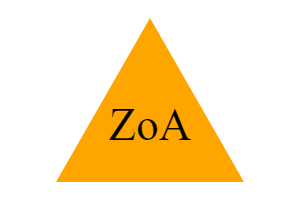
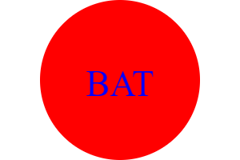
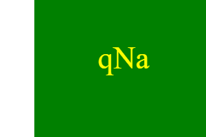

# Make-Your-Own-Logo

## Description

Make Your Own Logo generates a simple logo by taking in user input to generate a log and save it as an SVG file.  It was built to practice skills within object oriented programming including installing dependencies, running inquirer, and running jest.  It solves the issue of generating a logo without the need of a graphic designer. Some things that were learned throughout Make Your Own Logo are that you can configure an svg file with an array of parameters, callbacks are necessary for checking if methods are executed, and that Jest allows unit run tests necessary for testing larger coding libraries within future collaboration group projects.

## Table of Contents

* [Installation](#installation)
* [Usage](#usage)
* [Video](#video)
* [Credits](#credits)
* [Contributing](#contributing)
* [License](#license)
* [Tests](#tests)
* [Features](#features)
* [Questions](#questions)

## Installation

Within the root directory, install dependencies with the command "npm i" in the terminal.  Then, install inquirer with the command "npm i inquirer@8.2.4" in the terminal.  Inquirer will allow the inquirer prompt interface for user input.  Finally, install jest with the command "npm i jest" within the terminal.  Jest allows the unit run tests for each shape.

## Usage

To run this application, open up the terminal and enter "node index.js."  This will bring up the user command prompt with questions.  After answering each question accordingly, then a log in the terminal will display "Generated logo.svg."  A logo.svg file is generated within the root directory.  Right click the svg file and click "Open with Live Server."  This will display the svg file as a 300 x 200 pixel logo based on the user input within the default browser.  To run the test suite, refer to the Tests section within the Table of Contents.

**Attached is a screenshot of the inquirer command prompt:**

**Attached are generated example logos:**

## Video

**Attached is a link to the video walkthrough:**

[Video Walkthrough](https://drive.google.com/file/d/1asPoD5MpDIvY9H25pTOuxLcO0LR7_GAJ/view?usp=drive_link)

## Credits

[SVG Tutorial](https://developer.mozilla.org/en-US/docs/Web/SVG/Tutorial)

[Basic SVG shapes](https://developer.mozilla.org/en-US/docs/Web/SVG/Tutorial/Basic_Shapes)

[Text in SVG](https://developer.mozilla.org/en-US/docs/Web/SVG/Tutorial/Texts)

[SVG vs Code extension](https://marketplace.visualstudio.com/items?itemName=jock.svg)

[Node.js fs.writeFile() method](https://www.geeksforgeeks.org/node-js-fs-writefile-method/)

[Inheritance in Java](https://www.geeksforgeeks.org/inheritance-in-java/)

## Contributing

N/A

## License

MIT License

Copyright (c) 2024 Tyler-KD

Permission is hereby granted, free of charge, to any person obtaining a copy
of this software and associated documentation files (the "Software"), to deal
in the Software without restriction, including without limitation the rights
to use, copy, modify, merge, publish, distribute, sublicense, and/or sell
copies of the Software, and to permit persons to whom the Software is
furnished to do so, subject to the following conditions:

The above copyright notice and this permission notice shall be included in all
copies or substantial portions of the Software.

THE SOFTWARE IS PROVIDED "AS IS", WITHOUT WARRANTY OF ANY KIND, EXPRESS OR
IMPLIED, INCLUDING BUT NOT LIMITED TO THE WARRANTIES OF MERCHANTABILITY,
FITNESS FOR A PARTICULAR PURPOSE AND NONINFRINGEMENT. IN NO EVENT SHALL THE
AUTHORS OR COPYRIGHT HOLDERS BE LIABLE FOR ANY CLAIM, DAMAGES OR OTHER
LIABILITY, WHETHER IN AN ACTION OF CONTRACT, TORT OR OTHERWISE, ARISING FROM,
OUT OF OR IN CONNECTION WITH THE SOFTWARE OR THE USE OR OTHER DEALINGS IN THE
SOFTWARE.

* (https://choosealicense.com/licenses/mit/)

## Tests

To run the test suite, enter "npm run test" within the terminal.  Tests for each shape will test a svg file result with an expected string based on certain parameters.  If the tests for Triangle, Square, and Shape pass, then the object is rendered correctly.

**Attached is a screenshot of the test suite:**

## Features

node.js, npm (node package manager), inquirer 8.2.4, jest 29.7.0, fs(file system)

## Questions

If you have any questions, please visit [GitHub/Tyler-KD](https://github.com/Tyler-KD) or submit questions to tyler.kd.knapp@gmail.com.